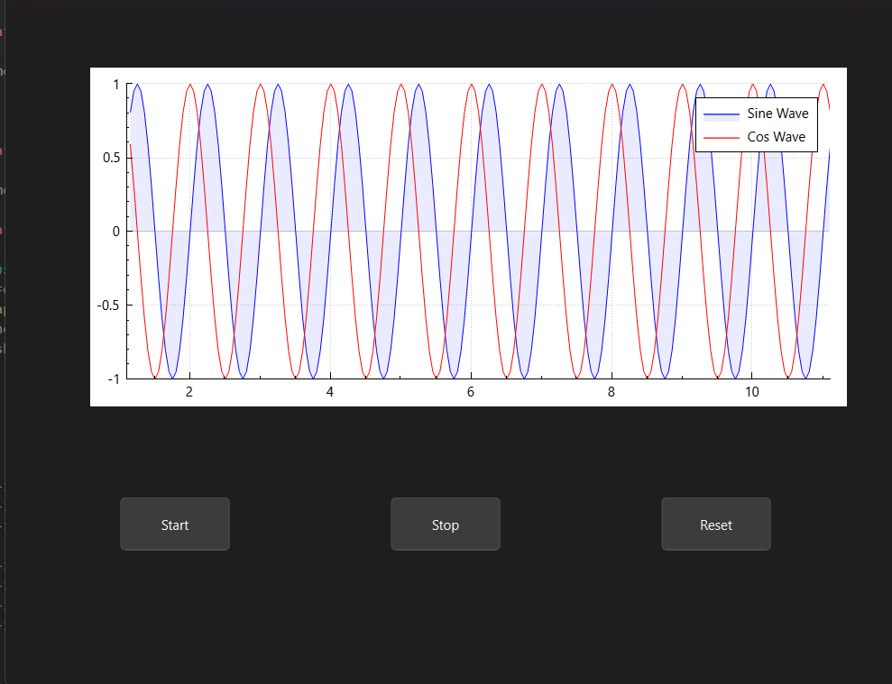

# Qt Live Sine and Cosine Plotter

This project is a real-time sine and cosine wave plotter built using Qt and QCustomPlot. The application continuously plots sine and cosine waves with smooth animation using a QTimer.

---

## Features

- Real-time plotting of sine and cosine waves
- Adjustable update interval (currently set to 50 ms)
- Start, Stop, and Reset controls
- Clear and concise legend identifying sine and cosine curves
- Smooth scrolling plot window showing the last 10 seconds of data

---

## Dependencies

- Qt 5.x or Qt 6.x (tested with Qt 5.15)
- [QCustomPlot](https://www.qcustomplot.com/) (included as source or linked)

---

## Building the Project

1. Clone or download the repository.
2. Open the project in Qt Creator.
3. Make sure `qcustomplot.h` and `qcustomplot.cpp` are included in your project.
4. Build the project.
5. Run the executable.

---

## Usage

- Click **Start** to begin plotting sine and cosine waves.
- Click **Stop** to pause the plotting.
- Click **Reset** to clear the plot and reset the time counter.
- The legend displays which curve is sine and which is cosine.
- The x-axis shows time (seconds), and the y-axis shows amplitude (-1 to 1).

---

## Sample Output

---

Thank you for checking out this project!  
Feel free to contribute, report issues, or suggest improvements. 
